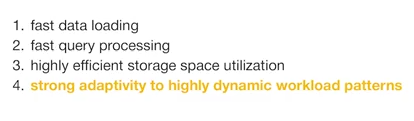
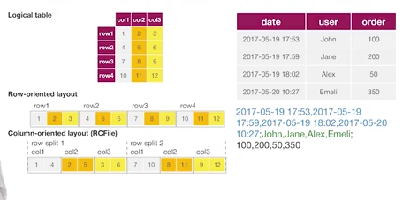

# RCFile Design Goal

### On comparing to ROW Oriented, COLUMN Oriented is much efficient in compressing because data in the same column have the same datatype, which is much easier to compress

**ORC / Parquet**