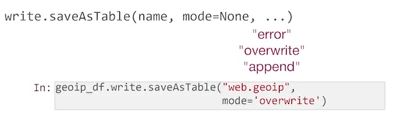

# Create connection
```
from pyspark.sql import SparkSession
spark_session = SparkSession\
                    .builder\
                    .enableHiveSupport()\
                    .appName("spark sql")\
                    .master("local")\
                    .getOrCreate()
```

# Show databases
```
spark_session.sql("""
    show databases
""").toPandas()

spark_session.catalog.listDatabases()

spark_session.catalog.listDatabases("web")
```

# Write
```
# Create writer object
geoip_df.write

# Save as HIVE table
geoip_df.write.saveAsTable("web.geoip_write")

# Save as an output file
# By default, Spark will store as binary Parquet format
geoip_df.write.save("geoip_out")

# Store as CSV
geoip_df.write.save("geoip_out", format='csv', mode='overwrite')
```

**If the table has existed already, an error will be thrown. We can overwrite it with another option**



# Read
```
# Create reader object
spark_session.read

geoip_from_json = spark_session\
    .read.json("geoip_json")

# Spark can also connect to Relational Databases
connection_string = "jdbc:mysql://localhost:3306/demo?"\
                    "user=demo&"\
                    "password=demo"

geoip_from_jdbc = spark_session\
    .read.jdbc(connection_string, "geoip")
```

