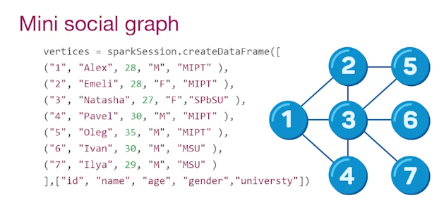
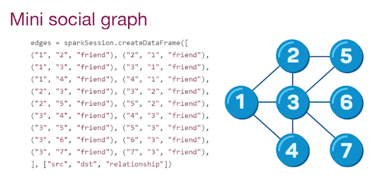

# GraphFrame
- GraphFrame is a graph processing library for Apache Spark
- Built on top of Spark DataFrame
    - Queries
    - Saving and Loading graph

### GraphFrame can be created from VERTEX and EDGE DataFrames
- a VERTEX DataFrame should contain column "id"
- an EDGE DataFrame should contain two special column "src" and "dst"

# Create GraphFrame
### Create vertices
```
vertices = sparkSession.createDataFrame(
    [... data],
    [... column name],
)
```



### Create edges
```
edges = sparkSession.createDataFrame(
    [... data],
    [... column name],
)
```



## Create GraphFrame
```
g = GraphFrame(vertices, edges)
```

how many user have "age" > 30
```
g.vertices
    .filter("age > 30")
    .show()
```