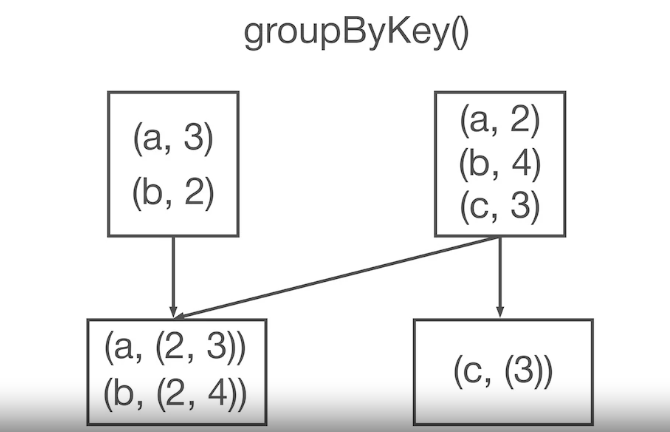
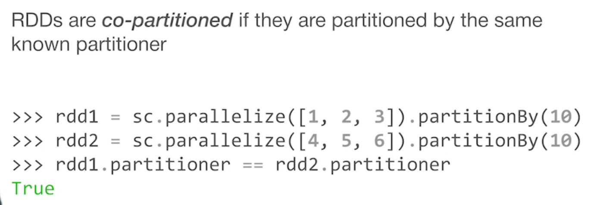
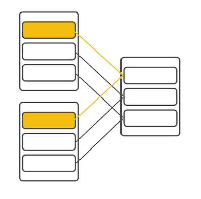
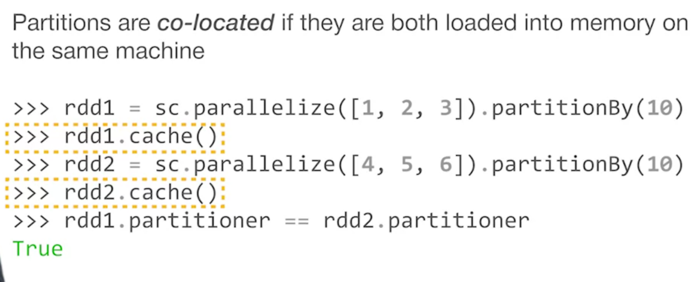
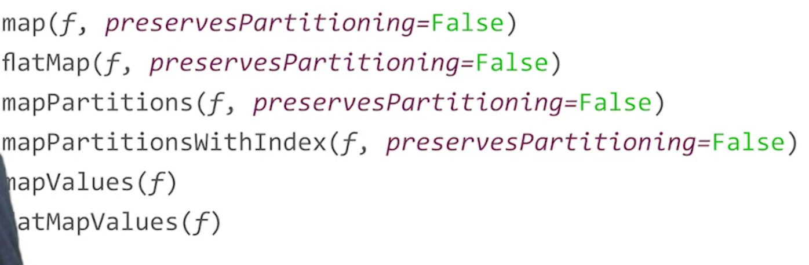
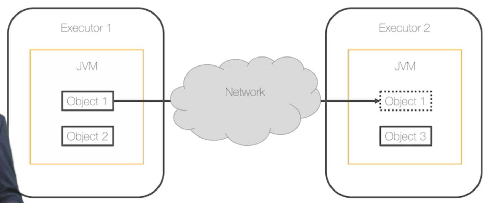
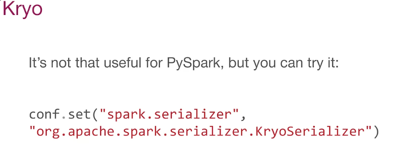
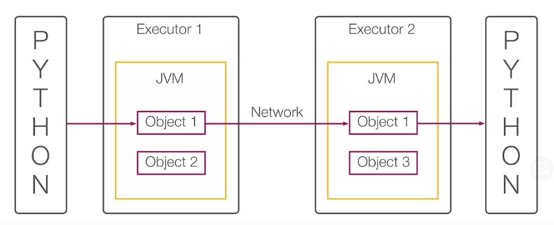
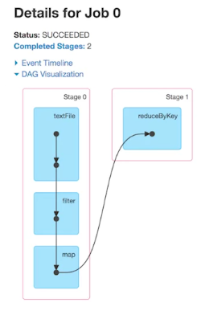
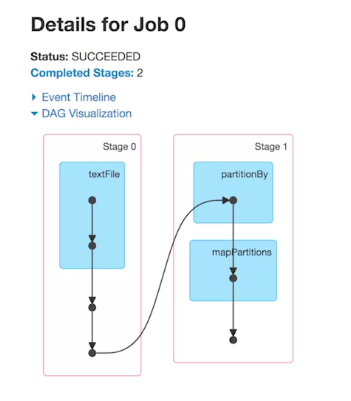

# To do shuffling, Spark must answer 2 question
- Where to send data
- How to send data

# 1, Where to send data
Assume that we have 2 executors. And do a wide transform to shuffle data to those 2 executors

Spark use partitioner to distribute data to executors

Partitioner is an interface with 2 methods
- numPartitions - numberof partitions in RDD after partitioning
- getPartition - mapping from a key to the index of partition
  
There are 2 types of partitioner in Spark
- Hash partitioner: use for something like groupByKey
- Range partitioner: use for something like like sort

## Ways to optimize shuffle
### First, co-partition
Two RDDs are called co-partition if they use the same partitioner

If using the same paritioner, to make a partition in the final RDD, Spark just merge each partition of the parent

### Second, co-located
If two RDDs are co-partition, they can be co-located if they are loaded into memory on the same machine. This is the best possible way to optimize **Where to send data**

If co-partition RDDs need further transformation, you can preserver their partition by preservesPartitioning parameter. But make sure don't change their key

# 2, How to send data

Spark executors have JVM internally, so RDD object must be serialized into a format that can be stored and sended easily through network

### Spark uses two serializers
- Java - slow, but it can handle any kind of objects
- Kryo - fast, but has corner cases

**PySpark is built on top of Scala**, which has some limitations.
By using PySpark, our data must be serialized two time, which is a performance issue.

PySpark developers have come up a solution for this, by pipelining operations inside the Python interpreter, this is great but it make our programs are harder to debug

Those are execution plan of the same job with using PySpark and not

