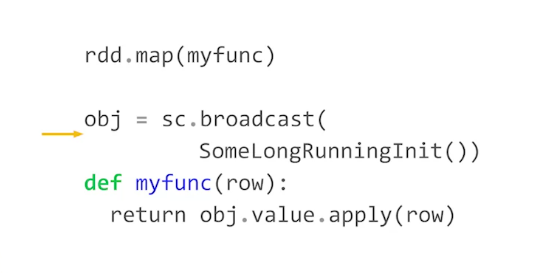
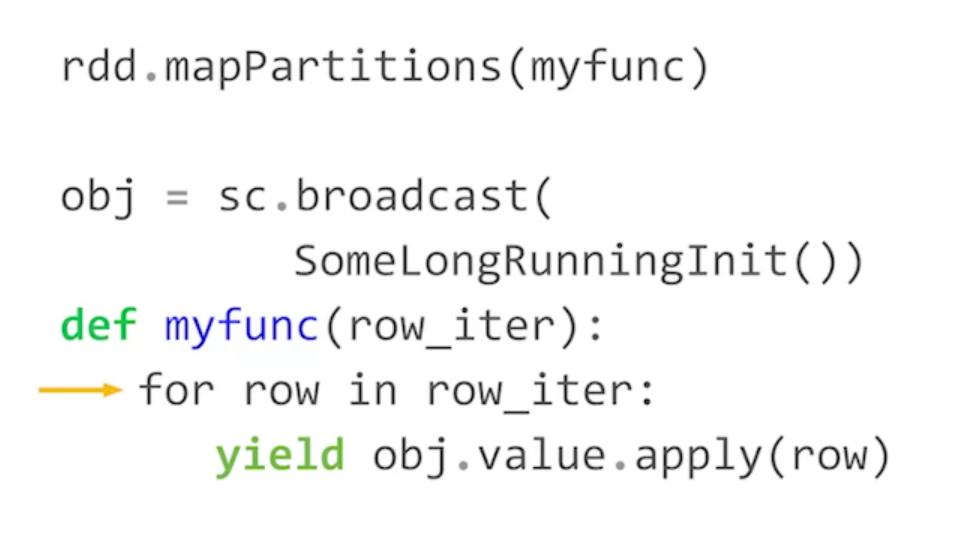

If you need to use a very long run function to map each row of an RDD, in stead of mapping for each row, you can map for the whole partition, and modify your function to receive iterator as its input, this can reduce much computation time

instead of this

use this

