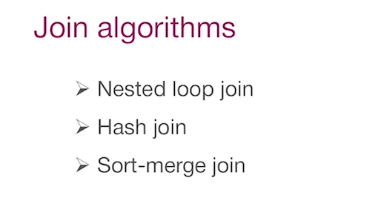
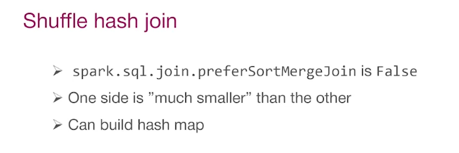
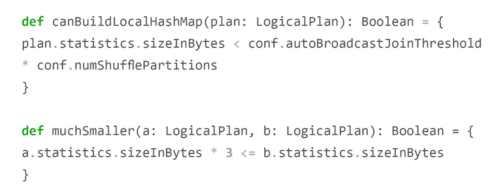
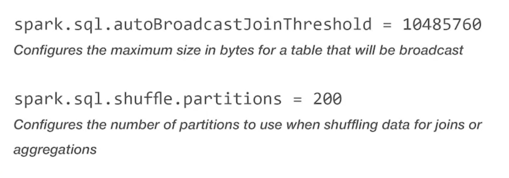
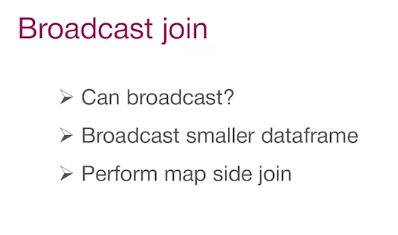

# Spark has 3 main Join algorithms

# Sort-Merge join is the default join because of its advantages, but it can only handle sortable key type

# Shuffle-Hash Join can be consider when one side Data is much smaller than the other, so it can easily create the hash map

Spark can check if we can use another Join algorithm using those two methods

We can change default threshold to use this Join algorithm

# The best possible way to Join is use the Broadcast Join, but to broadcast a dataset, it must be small

