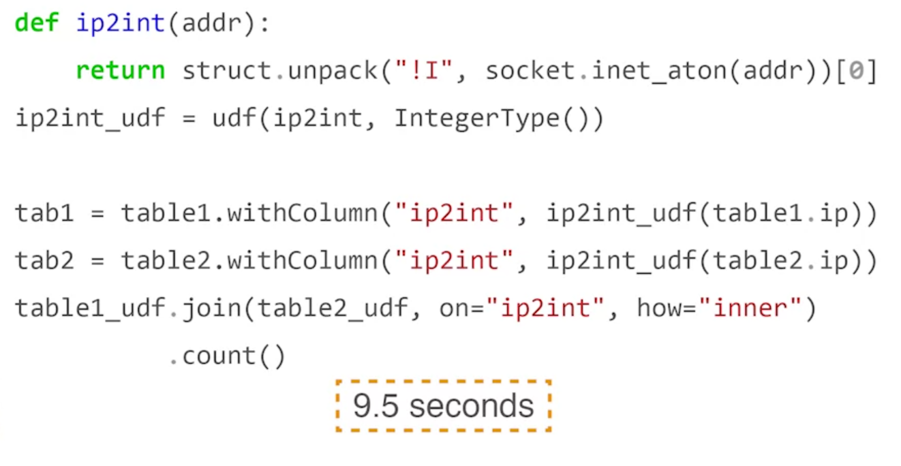

This is the original join

This is the version using UDF to map IP address, which is 5 times slower

# The reason is, Spark avoid using Python because it can slow down the computation, so there are some ways to optimize it

Here is the result using UDF written by Java and read to Spark by jar file through SparkContext. This approach just 2 times slower than the original one

