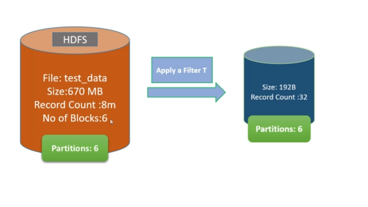
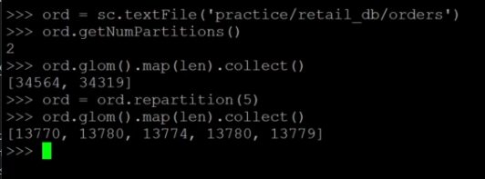
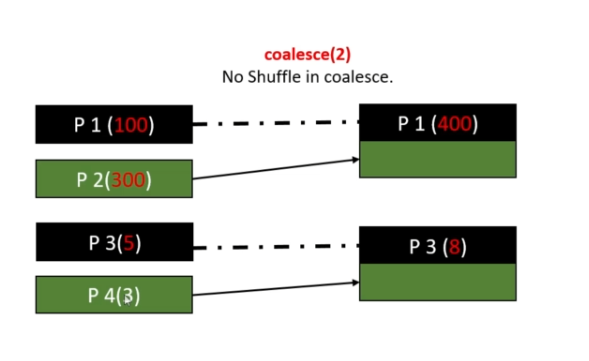
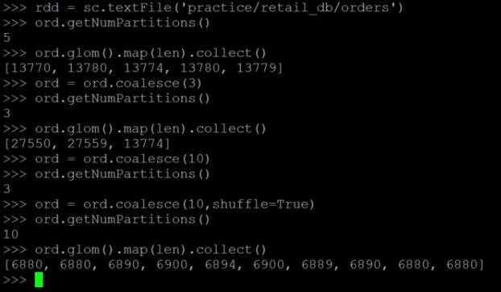

# Problem

on applying a filter on an RDD, the number of record might reduce, but number of partition remains the same. This is not good at all, so we should apply repartitioning to improve performance

# Repartition
- Repartition create almost equal in size partitions
- Spark perform better with equal sized partitions. If need processing of huge data, it is preferred to have equal sized partitions
- Repartition uses a shuffle to redistribute data, so avoid if not required
- If decrease the number of partitions, use **coalesce** instead, the cost for shuffling is lower

### Repartition with Sort
Use **repartitionAndSortWithinPartitions()** api

# coalesce(numPartitions, shuffle=False)
- Optimized version of repartition()
- No shuffling, so it only good for small dataset or the extraction because the partitions created is not equal in size
- Reduce number of partitions, but if parameter shuffle=True, it behaves like repartition()

