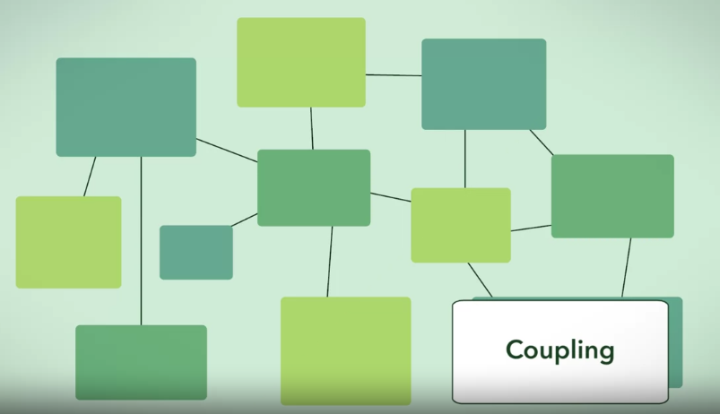
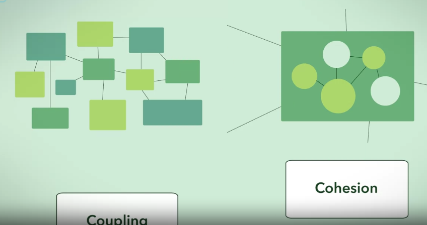

# Coupling is the connections between a module and other modules

We must let our modules find it easy to connect to other modules, which is ***Loosely Coupled*

# Cohesion is the complexity within a module

Each component within a module must have its clear purpose, which is **High Cohesion**

# A good design has **Low Couple** and **High Cohesion**