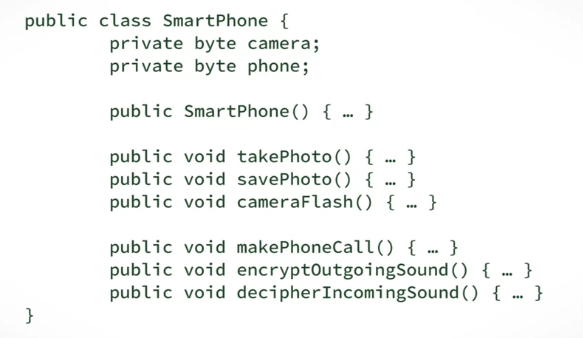
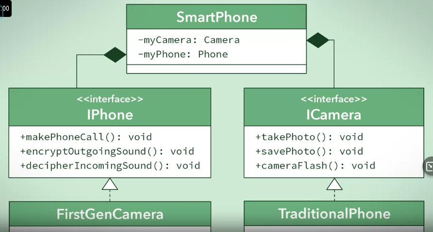

# Consider a SmartPhone having taking photos functionality and of course, making call
### Bad design

### Good design
We must separate functionality of a phone and a camera, which makes the design more cohesive but increase Couple complexity

