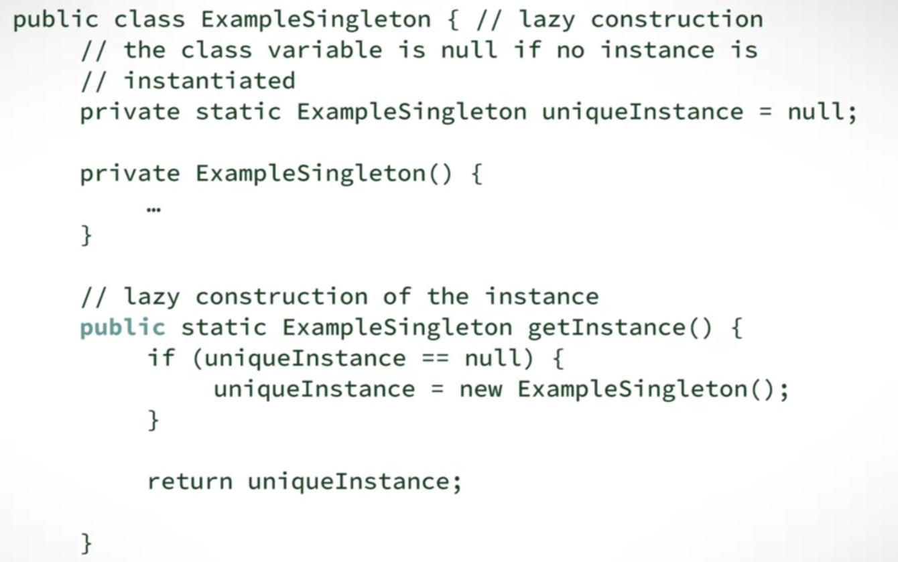

# Singleton pattern is the way you define a class that is only one instance of it can exist
for example, a class of config or user local data, only one of them is allowed to exist
- Enforce one and only one object of a Singleton class
- Has the Singleton object globally accessible

