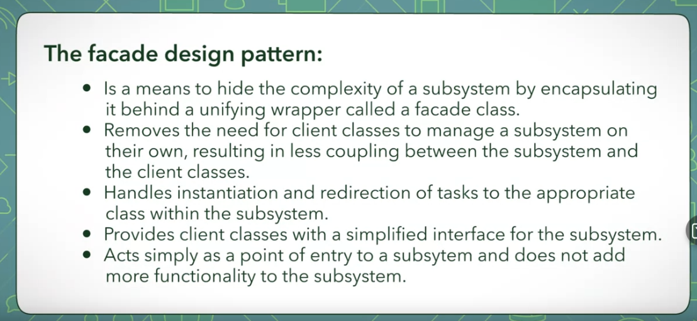
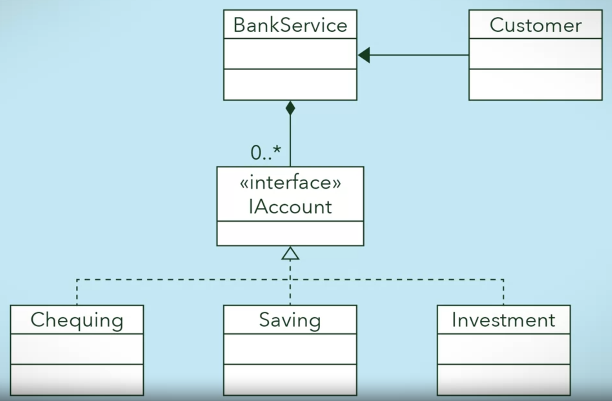

# Facade Pattern is the way to hide the complexion of a subsystem to a client
for example, consider a bank, when a customer come to withdraw money, he only need to talk to a receptionist 
in this case, a **Facade** class is the receptionist

