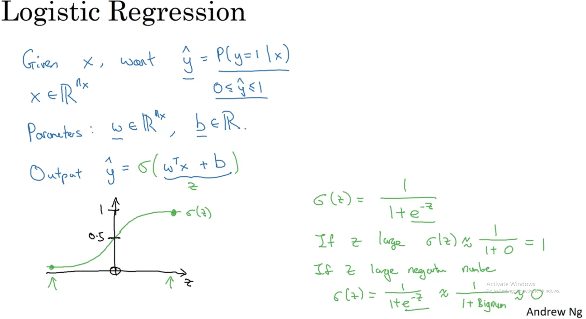
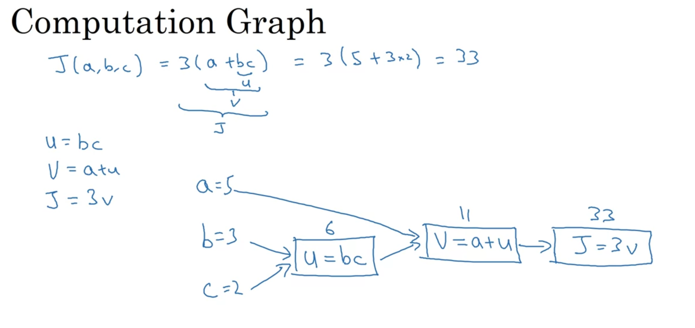
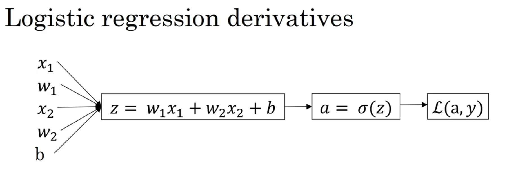

# Logistic Regression
Logistic Regression is mostly the same as Linear Regression, except for using a sigmoid function to reduce the calculation to between 0 and 1, which is better for probability

# Computation Graph represent Gradient Descent 
We can think of each step in Gradient Descent algorithm for Logistic Regression as the graph below

Here is the computation graph for derivatives and loss function

