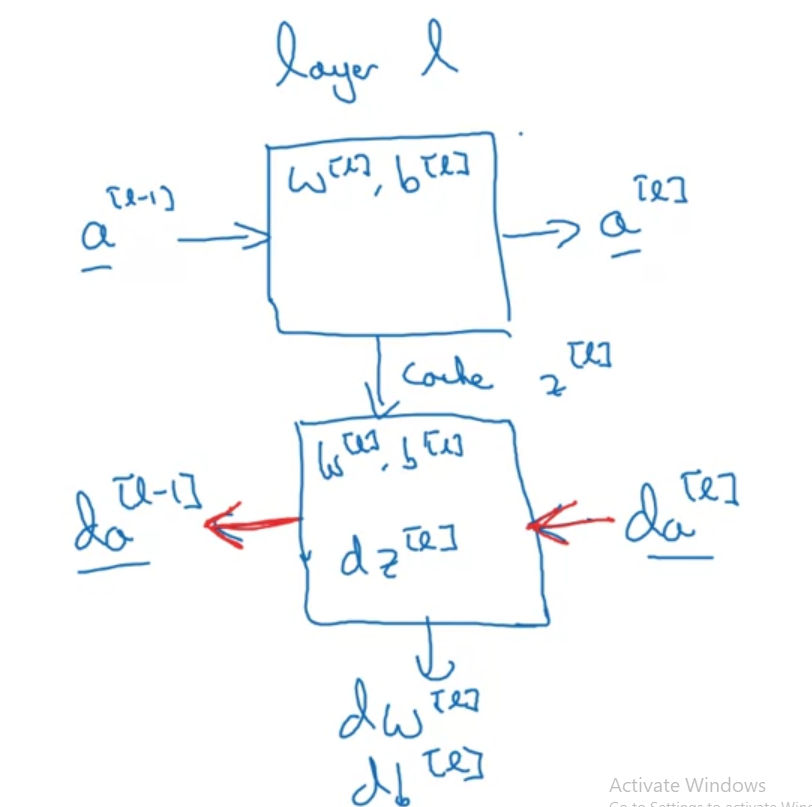
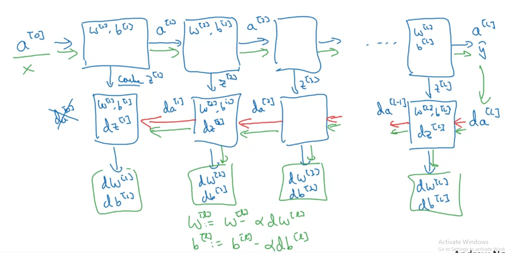

# Forward
## Input: A[l-1], output: A[l]

Z[l] = W[l] . A[l] + b[l]

A[l] = g[l](Z[l])

# Backward
## Input: dA[l], output: dA[l-1]

cache Z[l], output dA[l-1], dW[l], db[l]

dZ[l] = dA[l] * g[l]'(Z[l])

dW[l] = (1 / m) * dZ[l] . A[l-1].T
db[l] = (1 / m) * np.sum(dZ[l], axis=1, keepdims=True)

dA[l-1] = W[l].T . dZ[l]

