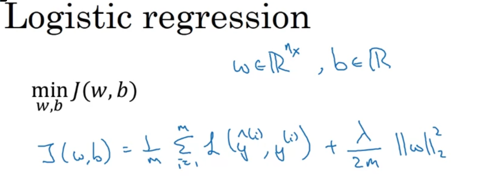

# Adding regularization to Neural Network can reduce over-fitting or high-variance
We can add a lambda to our Cost Function like this
## J(W, b) =  $\frac{1}{m}$ * $\sum_{i=1}^{m} L(output, y)$ + $\frac{\lambda}{2m}$ * ||w|| ^ 2
### It's called $L_{2}$ regularization

### **We don't regularize b because W is a high dimensional vector and having a lot of parameters, when b is only a one dimensional vector. Although you can regularize b but it won't make much different. So just ignore it!**

# Update W

$dW^L$ = (from backprop) + $\frac{\lambda}{m}$ $W^L$

$W^L$ := $W^L$ - $\alpha$ * $dW^L$

