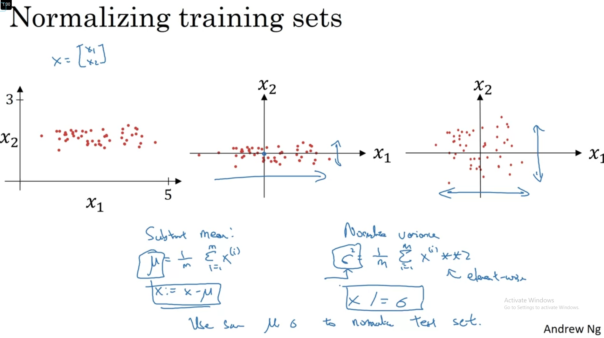

# Normalizing is the process to make all the features have the same mean 0 and variance 1

# When all features have the same scale, our algorithm takes less time to run because it can make more constant step