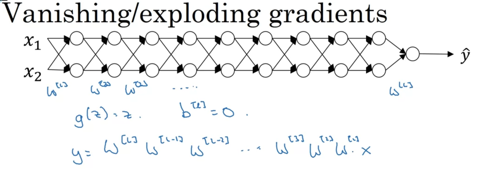
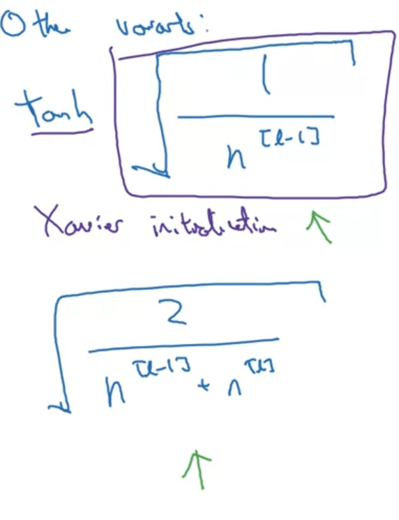

# Vanishing/Exploding is a very difficult problem to big networks
Assume that we have a very deep network with activation function for each layer is g(z) = z, b = 0 for simple.

After each layer computation, our layer-output will be multiply with another W. Which can scale to very large number for deep network

# Weight initialization for deep network

## Z = $w_{1}x_{1} + w_{2}x_{2} + w_{3}x_{3} + ... + w_{n}x_{n}$

for large n, we want smaller $w_{i}$

var(w) = $\frac{2}{n}$

So W for each layer can be initialized like this: 

# $W^L$ = np.random.rand(shape) * np.sqrt($\frac{2}{n^(l-1)}$)

We can use other variant for initialization

- tanh
  
  
