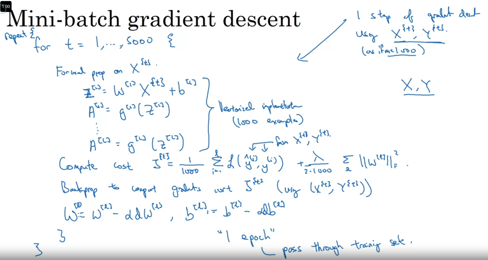
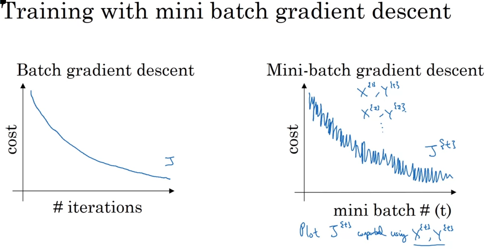
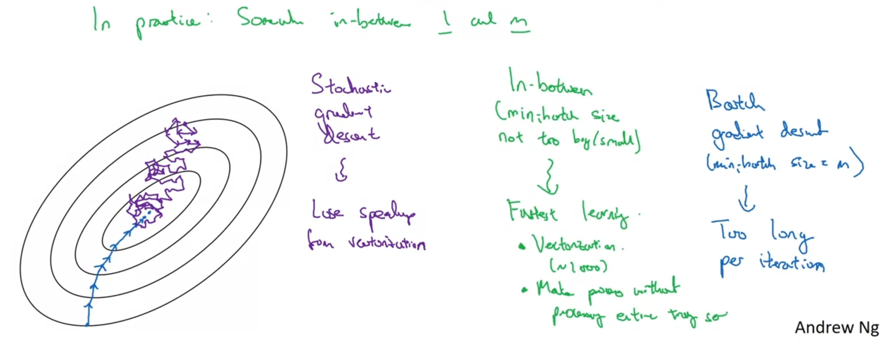
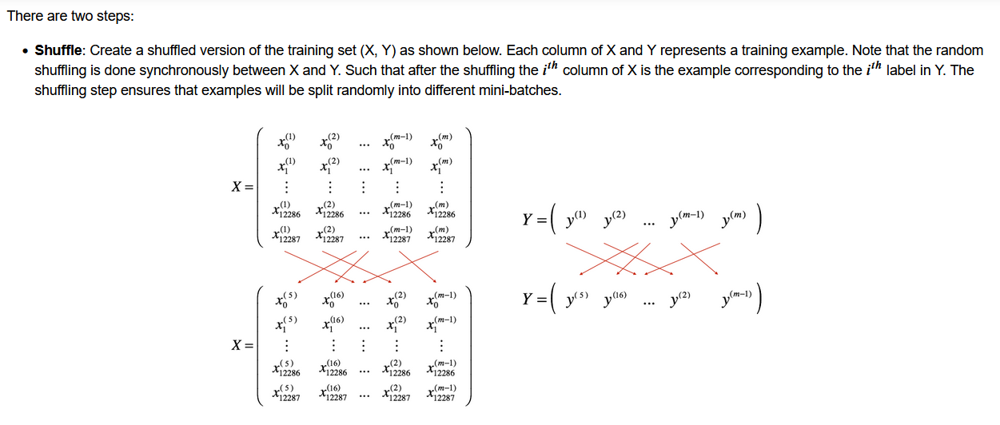
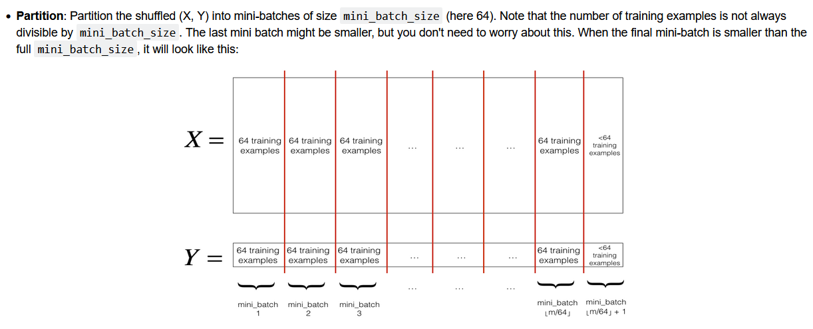

# When the dataset is too large, gradient descent will take too long to take a step
The idea of mini-batch gradient descent is we divide a large dataset into many smaller ones and do gradient descent with each of them.

This can make gradient descent take step faster, but will make noise in total lost computed.

Here is the algorithm:



Here is the plot to compare between batch and mini-batch algorithm



# Choosing batch size
If the batch size is too large (size = m), it will be batch gradient descent, and just take too long to take a step

If the batch size is too small (size = 1), you will loose speedup from vectorization



**Batch size should be the power of 2** for the computation mechanic of computers

# Implement mini-batch gradient descent

Implementing mini-batch gradient descent requires 2 steps:
- Shuffle
- Partition





```
def random_mini_batches(X, Y, mini_batch_size = 64, seed = 0):
    m = X.shape[1]                  # number of training examples
    mini_batches = []
        
    # Step 1: Shuffle (X, Y)
    permutation = list(np.random.permutation(m))
    shuffled_X = X[:, permutation]
    shuffled_Y = Y[:, permutation].reshape((1, m))
    
    inc = mini_batch_size

    # Step 2 - Partition (shuffled_X, shuffled_Y).
    # Cases with a complete mini batch size only i.e each of 64 examples.
    num_complete_minibatches = math.floor(m / mini_batch_size) # number of mini batches of size mini_batch_size in your partitionning
    for k in range(0, num_complete_minibatches):
        mini_batch_X = shuffled_X[:, k * mini_batch_size : (k + 1) * mini_batch_size]
        mini_batch_Y = shuffled_Y[:, k * mini_batch_size : (k + 1) * mini_batch_size]
        
        mini_batch = (mini_batch_X, mini_batch_Y)
        mini_batches.append(mini_batch)
    
    # For handling the end case (last mini-batch < mini_batch_size i.e less than 64)
    if m % mini_batch_size != 0:
        mini_batch_X = shuffled_X[:, num_complete_minibatches * mini_batch_size : m]
        mini_batch_Y = shuffled_Y[:, num_complete_minibatches * mini_batch_size : m]
        
        mini_batch = (mini_batch_X, mini_batch_Y)
        mini_batches.append(mini_batch)
    
    return mini_batches
```