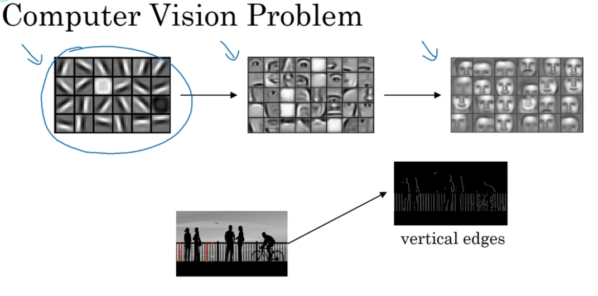
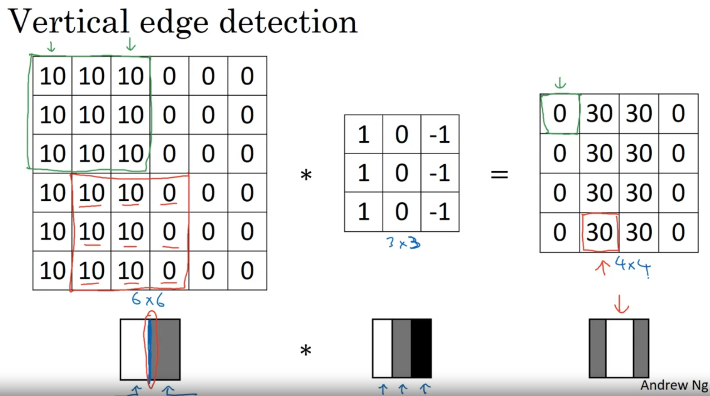
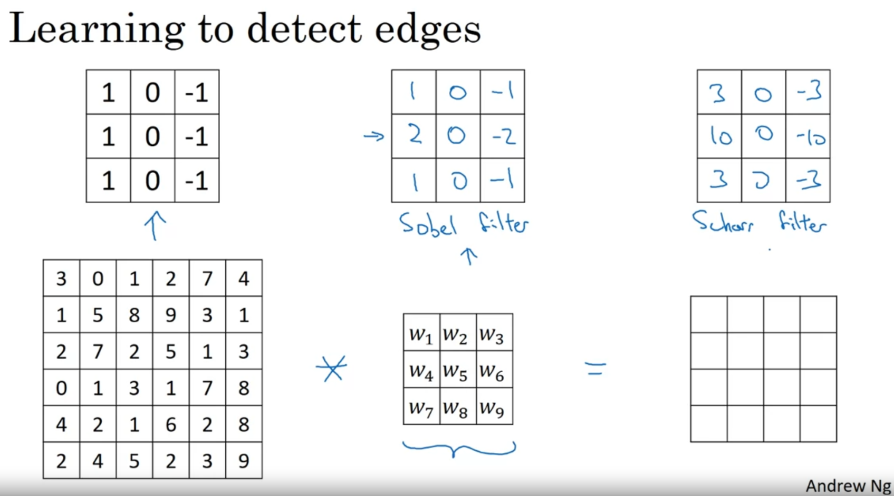
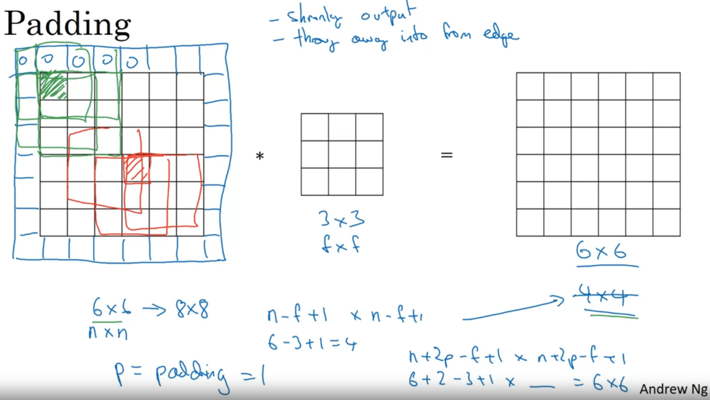
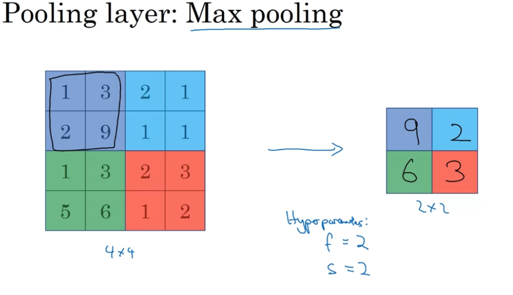
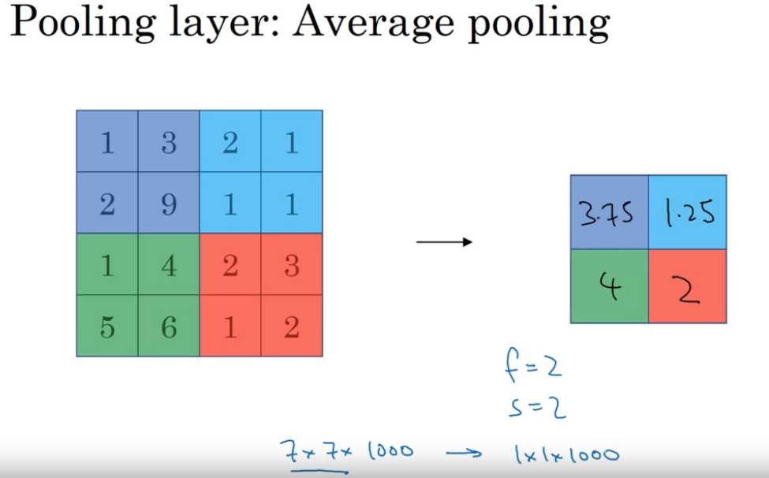

# For computer vision, first of all we need to detect edges of objects



# Convolution operation

We use a small matrix called "**filter**" to divide image matrix into "dark and light" area that can be detected later




```
def conv_single_step(a_slice_prev, W, b):
    """
    Apply one filter defined by parameters W on a single slice (a_slice_prev) of the output activation 
    of the previous layer.
    
    Arguments:
    a_slice_prev -- slice of input data of shape (f, f, n_C_prev)
    W -- Weight parameters contained in a window - matrix of shape (f, f, n_C_prev)
    b -- Bias parameters contained in a window - matrix of shape (1, 1, 1)
    
    Returns:
    Z -- a scalar value, the result of convolving the sliding window (W, b) on a slice x of the input data
    """

    s = W * a_slice_prev
    Z = np.sum(s, dtype=np.float)
    Z = Z + float(b)

    return Z
```

# Learn filter

Instead of prefix a filter matrix, we can set it to a parameter and learn it



# Padding

Some pixels in the edges of matrix may not be counted as many as the others in the middle. This can cause some problems:
- Our image matrix will be shrinked after each layer
- Pixels in edges are not trained well  
 
so we add some **padding** to make them counted equally



```
def zero_pad(X, pad):
    """
    Pad with zeros all images of the dataset X. The padding is applied to the height and width of an image, 
    as illustrated in Figure 1.
    
    Argument:
    X -- python numpy array of shape (m, n_H, n_W, n_C) representing a batch of m images
    pad -- integer, amount of padding around each image on vertical and horizontal dimensions
    
    Returns:
    X_pad -- padded image of shape (m, n_H + 2 * pad, n_W + 2 * pad, n_C)
    """
    X_pad = np.pad(X, ((0,0), (pad, pad), (pad, pad), (0,0)), mode='constant', constant_values = (0,0))
    
    return X_pad
```

# Pooling
Pooling can reduce the computation work



