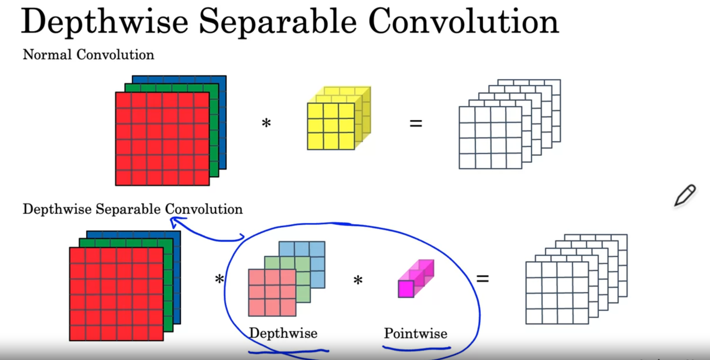
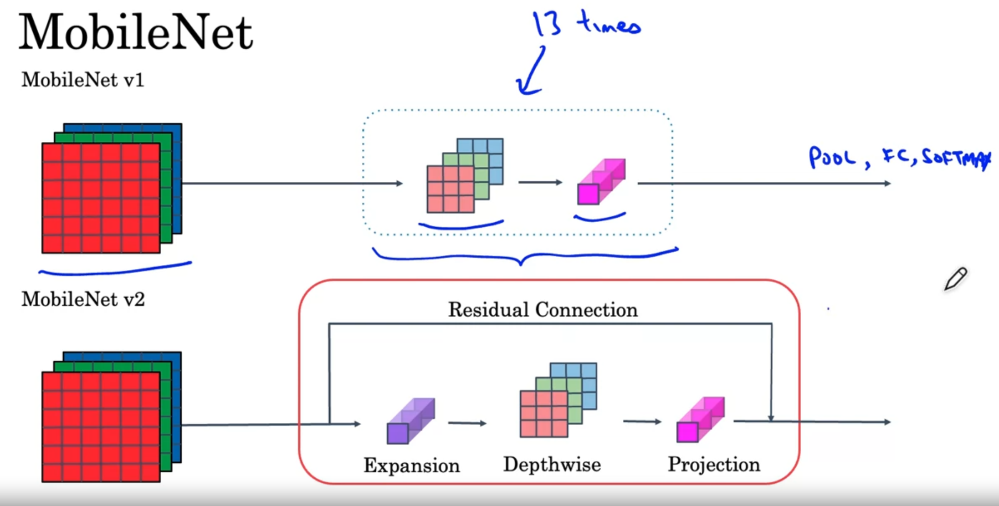
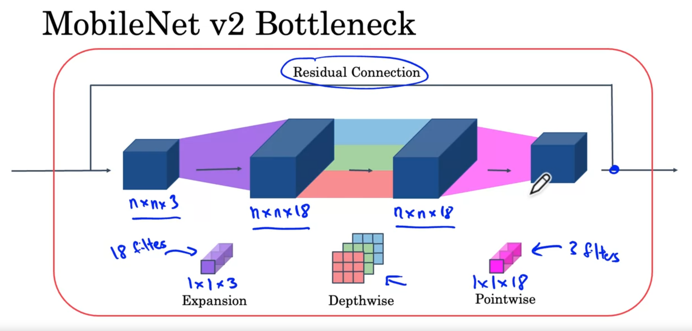

# MobileNet born to solve the problem lacking of computational resource environment such as mobile phone

Instead of normal convolution operation applying for every channel, we can apply single **n x n x 1** filter for each channel and then using a pointwise to increase channels and then finally can reduce computational cost 

# Mobilenet architecture

### Using an expansion layer can make network learn more complex function and then project it to original size to reduce memory consumption

