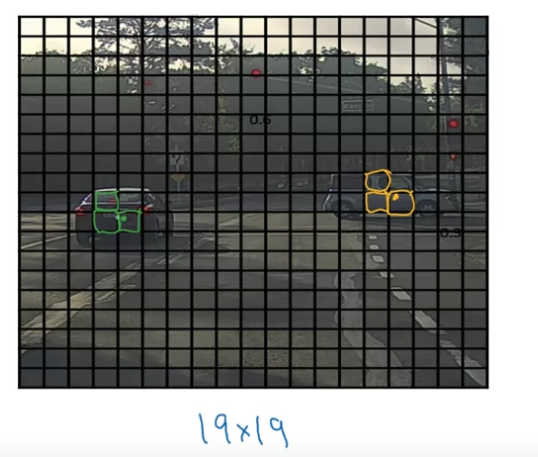
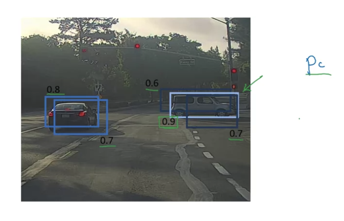
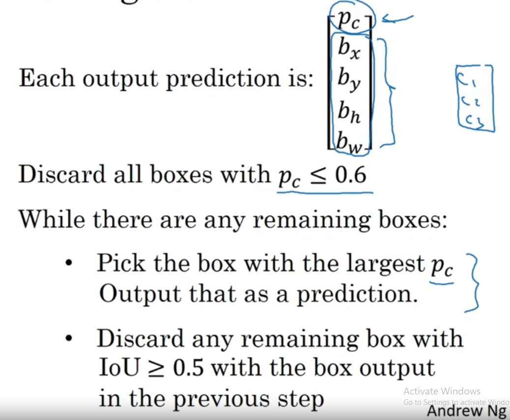

# When training using YOLO algorithm, we may encounter a problem that many square will think they have detected the center of the object

# When there are many border detected around an object, we should take a border which has the most pC value

