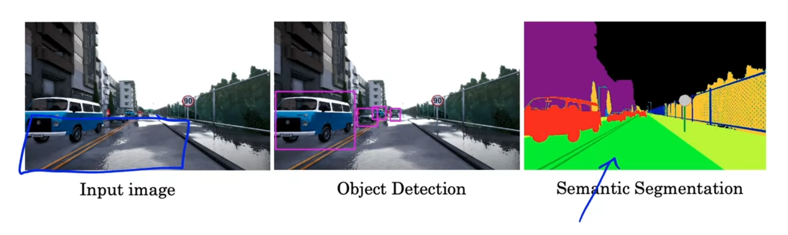
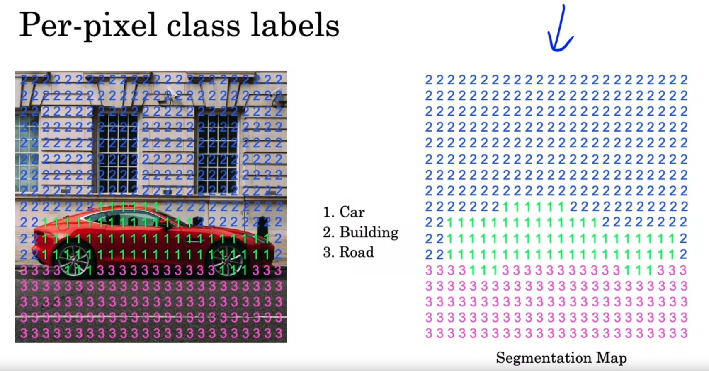

# Semantic segmentation is an algorithm applied to transform input image to something like that

# Using Semantic segmentation we can learn the border exactly on each pixel, not just simply the region containing the object

