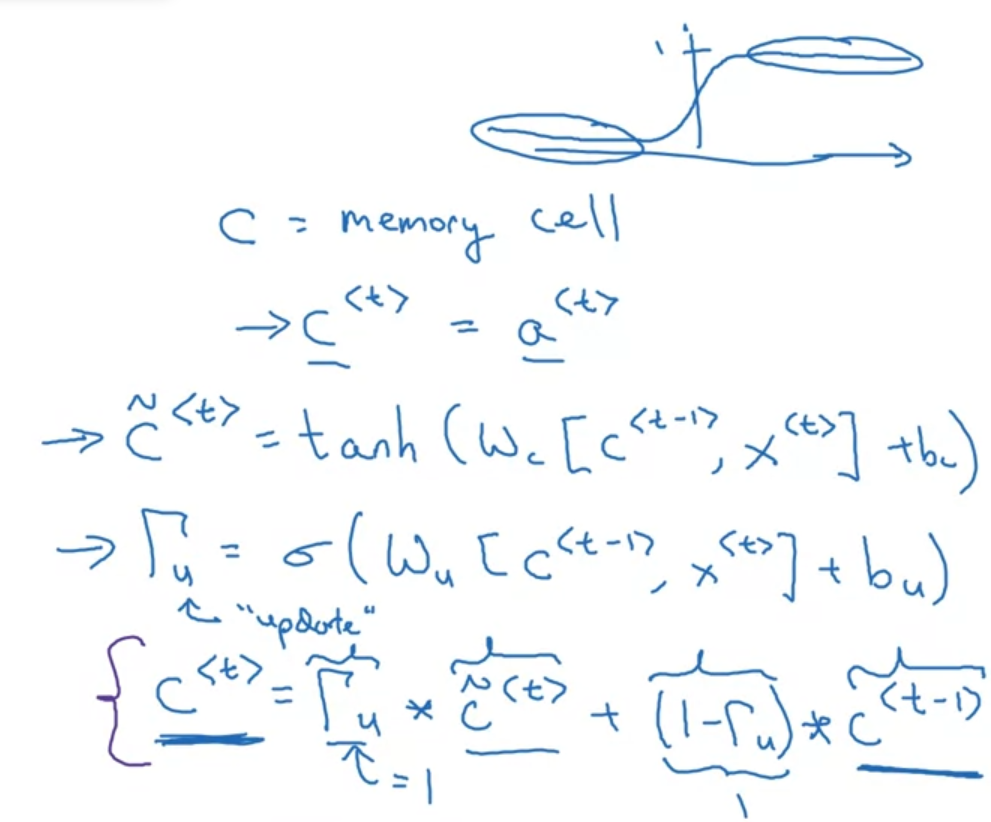
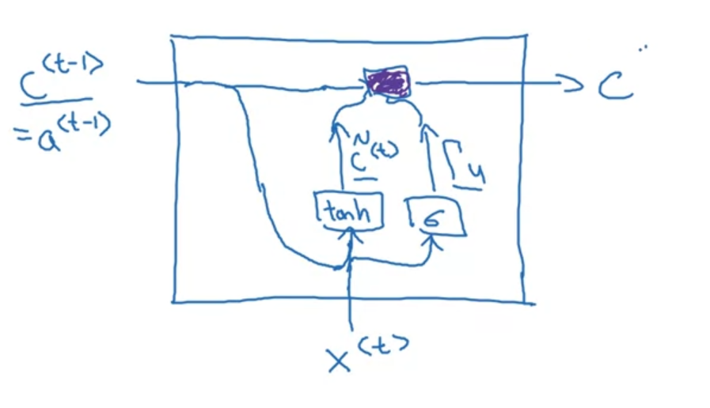
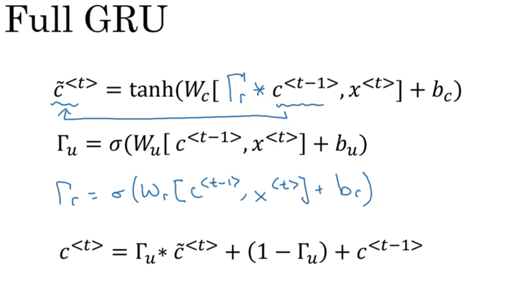

# Simplified GRU

GRU is an idea where we use some memory to create long dependencies of words in a sentence

For examples:

The **cat**, ... , **was** full

The **cats**, ... , **were** full

Consider **c** as an **memory cell** 

We calculate additional **Gate** (Gamma u) to consider to update current element in the memory by previous elements

# Full GRU

Addition to **Gamma u**, we can also use **Gamma r** to consider the relevant with its previous element

