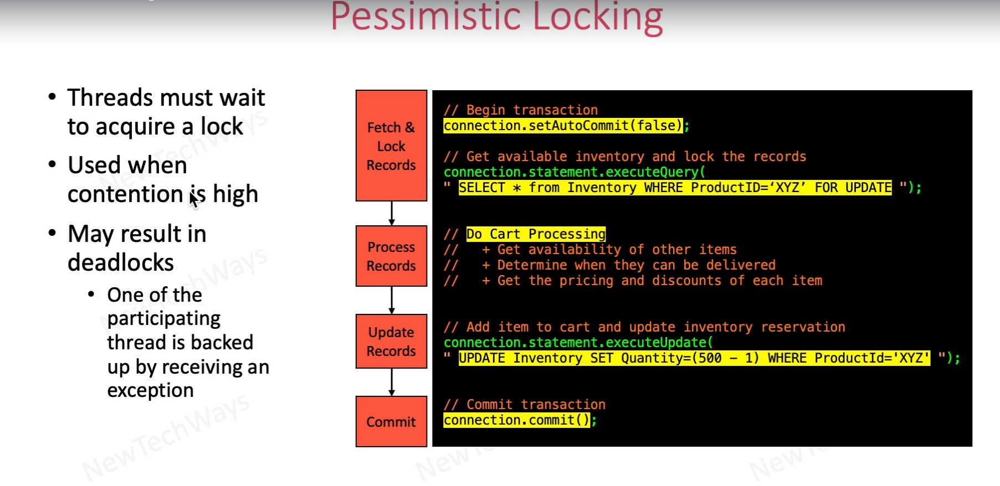
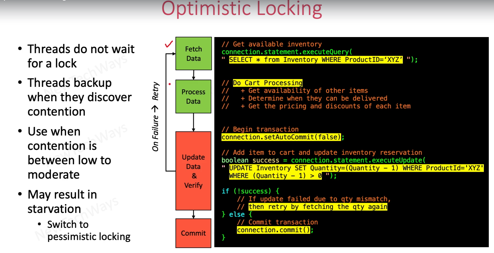

# Pessimistic Locking

Pessimistic Locking is the way we lock a record for each transaction need it.

# Optimistic Locking

Optimistic Locking use version or something to verify the update and only lock the resource when updates occur (reading do not lock resource). This allow multiple thread can access that resource in the same time. When perform an update, the thread check if it condition is verified, if not, it will refetch the resource and repeat it's transaction until it is completed.

Optimistic Locking is more suitable when the contention is low to moderate, because restart many thread will cause a large amount of performance.

