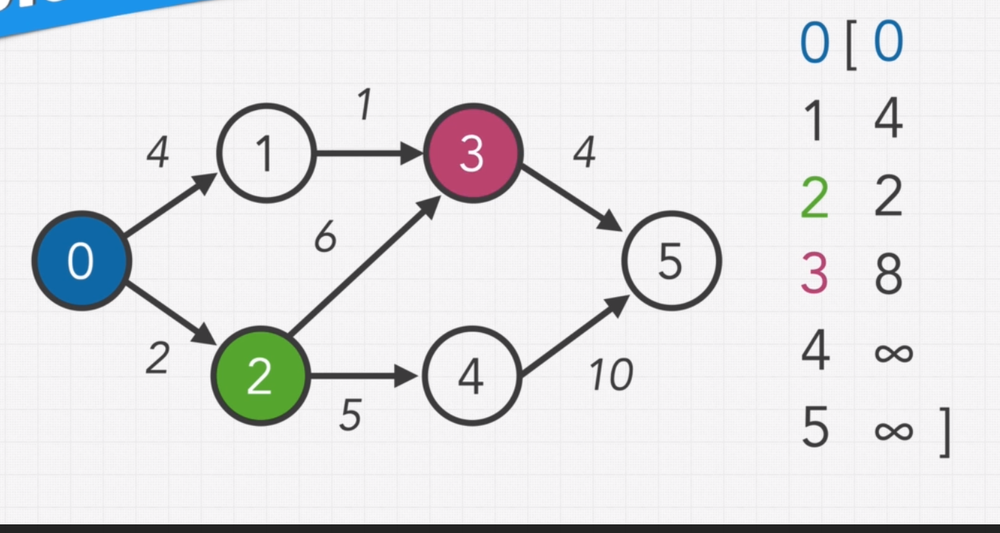

### Nguyên tắc của Greedy rất đơn giản: cứ đường ngắn nhất mà chọn

### DIJKSTRA Algorithm là thuật toán giải quyết nhược điểm của Greedy - là việc không suy nghĩ tới các điểm sau

## Ý tưởng thuật toán: lần lượt tìm các đường ngắn nhất từ từng điểm tới điểm đích

Ví dụ: Xuất phát từ điểm 0, tìm đường ngắn nhất có thể đi từ điểm 0 -> sang điểm 2
	- Tìm đường ngắn nhất có thể đi từ điểm 2 -> sang điểm 4 -> sang điểm 5
	- Sau khi update vào array, tìm điểm tốn thời gian ít nhất -> xuất phát từ điểm đó
	- Lặp lại tới khi thử qua hết các điểm

